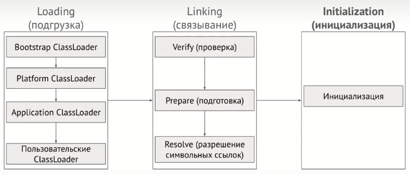

# Домашнее задание по теме «JVM. Организация памяти, сборщики мусора, VisualVM»
*JDCP-6_E.Orlov_HomeWork30*

## Задача 1 (обязательная)
Просмотрите код ниже и опишите (текстово или с картинками) каждую строку с точки зрения происходящего в JVM

Не забудьте упомянуть про:

+ ClassLoader’ы,
+ области памяти (стэк (и его фреймы), heap)
+ сборщик мусора
**Код для исследования**
```java
public class JvmComprehension {

    public static void main(String[] args) {
        int i = 1;                      // 1
        Object o = new Object();        // 2
        Integer ii = 2;                 // 3
        printAll(o, i, ii);             // 4
        System.out.println("finished"); // 7
    }

    private static void printAll(Object o, int i, Integer ii) {
        Integer uselessVar = 700;                   // 5
        System.out.println(o.toString() + i + ii);  // 6
    }
}
```
Ответ оформите в виде README.md в публичном гитрепо. На проверку скиньте ссылку на этот README.md в вашем репозитории.

---
## Решение
**Application ClassLoader** *(классы приложения)* начинает загрузку класса **JvmComprehension** и поиск каждого используемого класса, дальше по принципу наследования передаёт запрос поиска в **Platform ClassLoader** *(внешние классы)*, после ищет у себя **Bootstrap ClassLoader** *(встроенные в java)* для продолжения загрузки. 

Если **Bootstrap ClassLoader** не находит, то поиск возвращается по обратной цепочке. Ошибка, если нет нигде. 

Когда класс найден - загрузка данных о классе и констант в **MetaSpace** через связывание *(linking)*:
+ **Verify** - проверка кода на валидность,
+ **Prepare** - подготовка: выделяется место хранения в памяти под статические поля и объекты,
+ **Resolve** - разрешение символьных ссылок: превращение динамических в указатели на реальные объекты.


```java
package ru.netology;

public class JvmComprehension {

    public static void main(String[] args) {
        int i = 1;                      // 1 - фрейм `main` в стеке, `i` в этом фрейме
        Object o = new Object();        // 2 - `Object` в кучу, `new` создаёт ссылку `o` в фрейме `main`
        Integer ii = 2;                 // 3 - значение `2` в объекте `Integer` в куче, ссылка `ii` в фрейме `main`
        printAll(o, i, ii);             // 4 - фрейм `printAll` в стеке,
        // копия примитива `i` и новые ссылки `o` и `ii` в этом фрейме
        System.out.println("finished"); // 7 - закрытие фрейма `printAll`, сборщик мусора может удалять `uselessVar`,
        // создание фрейма `println` в стеке, создание объекта `String` со значением "finished" в куче и
        // передача ссылки на него в фрейм `println`, после отрабатывания и закрытия фрейма `println`,
        // сборщик мусора может удалять объект `String` из кучи.
    }
    // закрылся фрейм `main` в стеке с удалением примитива `i` и ссылок `o` и `ii`,
    // сборщик мусора может удалять объекты `Object` и `Integer` в куче.

    private static void printAll(Object o, int i, Integer ii) {
        Integer uselessVar = 700;                   // 5 - `Integer` значение `700` в куче,
        // ссылка `uselessVar` в фрейме `printAll`
        System.out.println(o.toString() + i + ii);  // 6 - создание отдельного фрейма вычисления в стеке,
        // в нём копия `i` и ссылки на `o` и `ii`, отработал новый фрейм `toString` в стеке и
        // передал значение `toString()` объекту `o`, вычисление значения `(o.toString() + i + ii)` и
        // сборщик мусора может чистить остатки фрейма `toString`,
        // создание фрейма `println` в стеке и передача в него значения вычисления `(o.toString() + i + ii)`,
        // закрытие фрейма вычисления, сборщик мусора может удалять его остатки: `o.toString()`, `i`, `ii`,
        // отработал и закрылся фрейм `println`, сборщик мусора может удалять значение `(o.toString() + i + ii)`.
    }
}
```
1. фрейм `main` в стеке, `i` в этом фрейме
2. `Object` в кучу, `new` создаёт ссылку `o` в фрейме `main`
3. значение `2` в объекте `Integer` в куче, ссылка `ii` в фрейме `main`
4. фрейм `printAll` в стеке, копия примитива `i` и новые ссылки `o` и `ii` в этом фрейме
5. `Integer` значение `700` в куче, ссылка `uselessVar` в фрейме `printAll`
6. для создания фрейма `println` в стеке:
   1. создание отдельного фрейма вычисления в стеке, в нём копия `i` и ссылки на `o` и `ii`, 
   2. отработал новый фрейм `toString` в стеке и передал значение `toString()` объекту `o`, 
   3. вычисление значения `(o.toString() + i + ii)` и сборщик мусора может чистить остатки фрейма `toString`, 
   4. создание фрейма `println` в стеке и передача в него значения вычисления `(o.toString() + i + ii)`, 
   5. закрытие фрейма вычисления, сборщик мусора может удалять его остатки: `o.toString()`, `i`, `ii`, 
   6. отработал и закрылся фрейм `println`, сборщик мусора может удалять значение `(o.toString() + i + ii)`.
7.  закрытие фрейма `printAll`, сборщик мусора может удалять `uselessVar`, создание фрейма `println` в стеке, создание объекта `String` со значением "finished" в куче и передача ссылки на него в фрейм `println`, после отрабатывания и закрытия фрейма `println`, сборщик мусора может удалять объект `String` из кучи.

Когда закрылся фрейм `main` в стеке с удалением примитива `i` и ссылок `o` и `ii`, сборщик мусора может удалять объекты `Object` и `Integer` в куче.
#
**Примечание**: "сборщик мусора может удалять" - значит помечено к удалению и будет удалено при очередном проходе сборщика.

